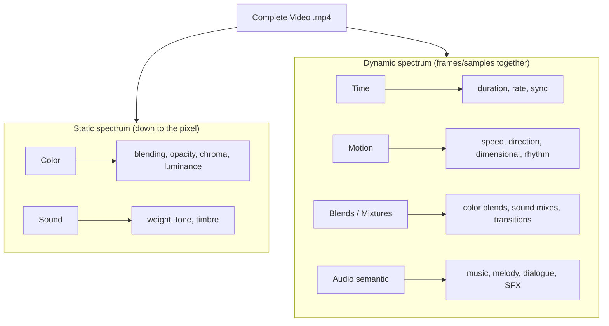
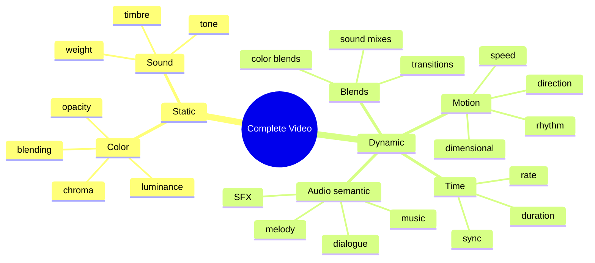
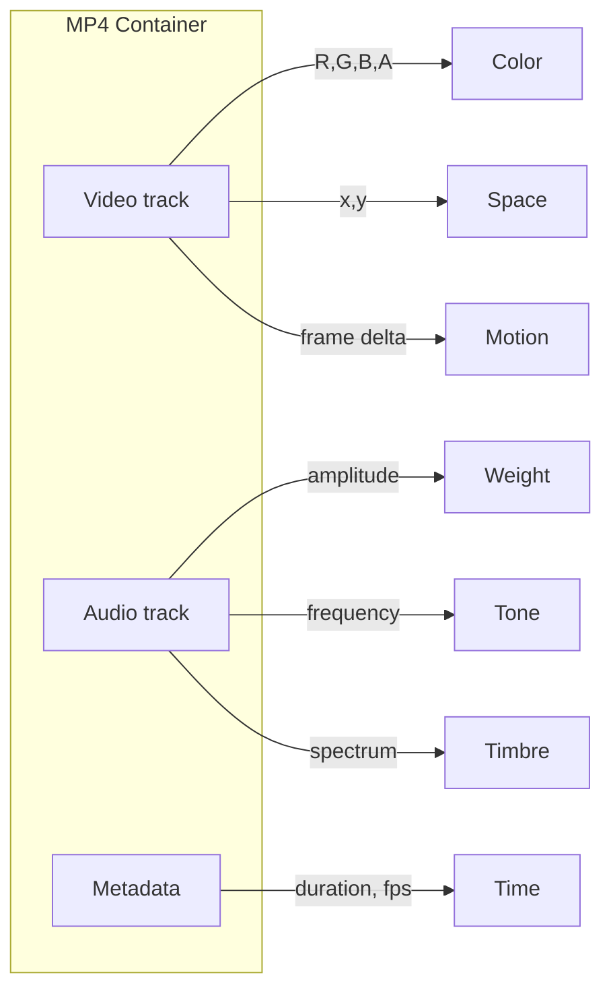

# Static Elements Registry

**One frame = one instance.** The static registry holds **pure elements** and **purely blended elements that become a single value**: **color** and **sound** only. Every pixel is color; every audio sample is sound. When blending (within any category) produces a **single value** (e.g. one new RGB, one new sound profile), that result is a newly discovered pure element and is recorded here under color or sound, with a generated name if unnamed. No other categories are static. For the definitive mapping of every MP4 element into the three registries, see [REGISTRY_TAXONOMY.md](REGISTRY_TAXONOMY.md). For the dynamic registry, see [DYNAMIC_ELEMENTS_REGISTRY.md](DYNAMIC_ELEMENTS_REGISTRY.md). For a short overview, see [REGISTRY_README.md](REGISTRY_README.md).

**Accuracy vs precision:** Registries must be **100% accurate** (what we record). Algorithms and functions that extract and grow live in **scripts and code** and must be **100% precise**; they are not stored in the registries.

---

## 0. Project goal: record every instance & utilize the name-generator

**Goal:** Record **every instance** of **static** elements that appear inside **every instance** (every frame — **color** and **sound**), including **purely blended results that resolve to a single value** (new color or new sound).

- **Per frame:** If a static value (color/sound) or a purely blended single-value result is not in the registry → **record it**. If it has no official name → use the **name-generator** so names are **sensible** (readable, consistent, not nonsensical).

**Static registry:** Color, Sound (per-pixel/per-sample and purely blended single-value discoveries). Record novel values; use name-generator when unnamed.

**Name-generator:** Produces **sensible**, human-readable names (e.g. `color_amberglow`, `sound_calmwave`). No random character soup. Implemented in `src/knowledge/blend_names.py` (`generate_sensible_name`, `generate_blend_name`).

---

## 1. Registry organization (easy to read)

- **Location:** `knowledge/static/`
- **Files:** `static_colors.json`, `static_sound.json`
- **Format:** Each file has:
  - `_meta` — registry type, goal, aspect description, sub-aspects (for readers)
  - `entries` — list of recorded values; each entry includes key, value, name, count, sources
  - `count` — number of entries

Code: `src/knowledge/static_registry.py` — `load_static_registry()`, `save_static_registry()`, `STATIC_ASPECTS`.

---

## 2. Complete list of aspects (static only)

Every aspect of a complete video that belongs in the **static** registry (one frame) is listed below. All must be recorded.

| Aspect | Sub-aspects | Description |
|--------|-------------|-------------|
| **Color** | blending, opacity, chroma, luminance, hue, saturation, brightness, contrast | Visual value at each pixel (R, G, B, A and derived). |
| **Sound** | weight, tone, timbre, amplitude | Aural value at each sample (amplitude); tone/timbre from sample runs. |

Only these two aspects are **static** (single-frame); purely blended single-value results are recorded here under color or sound. Everything else (motion, time, semantic audio, lighting, etc.) is in the [dynamic registry](DYNAMIC_ELEMENTS_REGISTRY.md).

---

## 3. Extraction process

Target **every individual frame**. For each frame:

1. Extract color (dominant RGB, brightness, luminance, contrast, saturation, chroma, hue, variance, opacity).
2. Extract sound (amplitude/weight, tone, timbre per segment from decoded audio; or spec-derived fallback).
3. For each value not already in the static registry → add it; if unnamed → assign a name via the name-generator.

Code: `src/knowledge/extractor_per_instance.py` — `extract_static_per_frame()` yields one dict per frame with `color` (all sub-aspects) and `sound`.

For a canonical checklist of every MP4 aspect and how it is covered, see [MP4_ASPECT_COVERAGE.md](MP4_ASPECT_COVERAGE.md). For an audit of every function and algorithm (complete vs needs work), see [REGISTRY_AND_LOOP_AUDIT.md](REGISTRY_AND_LOOP_AUDIT.md).

---

## 4. Scope: Everything Down to the Pixel (ontology)

---

## 5. Scope: Everything Down to the Pixel

The registry aims to contain **absolutely everything** that a complete MP4 consists of:

- **Video track**: At the pixel, the only stored values are **color** (R, G, B and optionally A). So the visual origin of every pixel is **color**—including when we talk about “light” or brightness: that is a *value* or *dimension* of color (e.g. luminance derived from the blending of multiple colors). So **light falls under the color category**.
- **Audio track**: Each sample is a value whose origins are **sound** (amplitude, frequency, spectrum).
- **Time**: Duration, rate, and sync bind the above.

So the registry is exhaustive: every aspect of a complete video, from container-level metadata down to per-pixel and per-sample origins.

### 1.1 Atomic units: what “down to the pixel” means for each track

For **video**, the atom is the **pixel**: one color value (R,G,B,A) at position (x,y) in a frame. For **sound** and **time**, the same idea is “one stored value at the smallest addressable unit.” Here’s the parallel:

| Track   | Atomic unit     | What is stored at that unit?        | Origin name for that value |
|---------|-----------------|-------------------------------------|----------------------------|
| **Video** | **Pixel**      | One color (R, G, B, A) at (x, y)    | **Color** (blending, opacity, chroma, luminance) |
| **Audio** | **Sample**     | One **amplitude** value (per channel) at one instant | **Sound** → at the sample, the value is **amplitude** (weight) |
| **Time**   | **Tick**       | One **position on the timeline** (index or timestamp) | **Time** (duration, rate, sync) |

- **Sound down to the “pixel” (the sample)**  
  Audio has no 2D grid; it’s a 1D sequence over time. The atom is the **sample**: one number per channel at one time step (e.g. every 1/44100 s). At that instant the only stored value is **amplitude**—the sample value. So the “noise” or content that audio brings, down to the sample, is **amplitude** (how much displacement/level at that moment). Tone (pitch) and timbre are *derived* from many samples (frequency spectrum); at the single-sample level we only have **amplitude**. So: **sound, down to the sample = amplitude** (weight at that instant).

- **Time down to the “pixel” (the tick)**  
  Time doesn’t store a “content” value like color or amplitude; it’s the **axis** that positions every pixel and every sample. So “down to the pixel” for time means the **smallest time quantum** the format uses:
  - **Video**: one **frame** = 1/fps (e.g. 1/24 s ≈ 41.67 ms). The time “pixel” for the picture is the frame interval.
  - **Audio**: one **sample** = 1/sample_rate (e.g. 1/44100 s ≈ 0.023 ms). The time “pixel” for sound is the sample interval.
  - **Container**: timestamps are often in **timescale** ticks or **milliseconds**. So time is described down to a **tick** (e.g. 1 ms, or one frame, or one sample). The “value” at that level is **position on the timeline**—an index (frame number, sample number) or a timestamp. So: **time, down to the tick = position on the timeline** (when something happens), with the **quantum** being frame interval, sample interval, or a chosen unit like the millisecond.

Summary in one line:
- **Visual**: one **pixel** = one **color** (R,G,B,A).
- **Aural**: one **sample** = one **amplitude** (the “noise” at that instant).
- **Temporal**: one **tick** = one **position** on the timeline (with quantum = frame, sample, or ms).

---

## 6. Two Spectrums: Static vs Dynamic

Color and sound are **static** at the atomic level (one pixel, one sample). When we put **frames** (and sample sequences) together, **dynamic** aspects appear: time as measurement, motion, blends of the two statics, and semantic audio (music, dialogue, SFX). The registry separates these two spectrums.

### 2.1 Static spectrum — the big 2 (down to the pixel)

At a single instant, a single pixel, or a single sample, only two kinds of “content” exist:

| Aspect   | Atomic unit | What is stored | Registry name |
|----------|-------------|----------------|---------------|
| **Color**  | Pixel       | R, G, B, A (blending, opacity, chroma, luminance) | **Color** |
| **Sound**  | Sample      | Amplitude (weight); tone/timbre derived from many samples | **Sound** |

Nothing else is “content” at that level. **Time** and **motion** do not exist at one pixel or one sample—they appear only when we have a sequence (frames, samples). So the **static spectrum** contains exactly:

1. **Color** — the visual value at each pixel (the big 2).
2. **Sound** — the aural value at each sample (the big 2).

### 2.2 Dynamic spectrum — when frames (and samples) are put together

When we consider **sequences** (many frames, many samples), new aspects appear:

| Aspect   | What we measure | Registry name | Sub-origins (see below) |
|----------|------------------|----------------|--------------------------|
| **Time** | Duration, rate, sync, position on timeline | **Time** | duration, rate, sync, tick |
| **Motion** | Change over time: speed, direction, dimension | **Motion** | speed, direction, position over time, rhythm, dimensional |
| **Blends / mixtures** | Compositions of the two statics (color + color over time; sound + sound) | **Blends** | color blends, sound mixes, transitions |
| **Audio (semantic)** | *Type* or role of audio: music, melody, dialogue, SFX | **Audio (semantic)** | music, melody, dialogue, SFX |

So the **dynamic spectrum** contains:

1. **Time** — measurement: duration, rate, sync.
2. **Motion** — speed, direction, dimensional (position over time).
3. **Blends / mixtures** — composed of the two statics (e.g. color blends, sound mixes).
4. **Audio (semantic)** — music, melody, dialogue, SFX (not just amplitude at the sample).

```
                    COMPLETE VIDEO (.mp4)
                              │
              ┌───────────────┴───────────────┐
              │                               │
     STATIC SPECTRUM                 DYNAMIC SPECTRUM
     (down to the pixel)             (when frames/samples are put together)
              │                               │
     ┌────────┴────────┐             ┌────────┴────────────────────────┐
     │                 │             │         │         │              │
  COLOR            SOUND         TIME     MOTION   BLENDS/MIX   AUDIO (semantic)
  (pixel)          (sample)    (measure)  (speed,   (of the     (music, melody,
  R,G,B,A          amplitude   duration,   dir.,     two         dialogue, SFX)
                   weight      rate, sync  dim.)    statics)
```

---

## 7. What Is an MP4, at the Source? (technical view)

An **MP4** (MPEG-4 Part 14) file is a **container** that holds:

| Track type   | What it stores                                      | Encoded as              |
|-------------|------------------------------------------------------|-------------------------|
| **Video**   | A sequence of **frames**: grid of pixels over time   | e.g. H.264/HEVC (YUV + optional alpha) |
| **Audio**   | A sequence of **samples**: pressure over time        | e.g. AAC                |
| **Metadata**| Duration, framerate, sample rate, sync               | Container headers       |

At the **technical** level, every value in a complete video comes from:

1. **Color** — What we see at each pixel: R, G, B (and optionally A). “Light” or luminance is a *derived value of color* (e.g. from blending); it belongs in the color category.
2. **Space** — Where it is: each pixel has position (x, y) in the frame; composition and layout.
3. **Time (visual)** — When it changes: frames over time → **motion** (speed, direction, position over time).
4. **Sound** — What we hear: each sample is amplitude, frequency, spectrum (weight, tone, timbre).
5. **Time (binding)** — Duration, framerate, sample rate, and sync between video and audio.

From that we derive the **origin aspects** below, split into **Static** and **Dynamic** (see §2).

---

## 8. Origin Aspects: Static + Dynamic (full registry)

Every value in a complete video traces to one of these. **Static** = the big 2 at the pixel/sample. **Dynamic** = what appears when frames/samples are put together.

### 4.0 Summary table by spectrum

| Spectrum | Aspect | Registry name | Sub-origins |
|----------|--------|---------------|--------------|
| **Static** | Color (pixel value) | **Color** | blending, opacity, hue, saturation, luminance |
| **Static** | Sound (sample value) | **Sound** | weight (amplitude), tone, timbre |
| **Dynamic** | Time (measurement) | **Time** | duration, rate, sync, position on timeline |
| **Dynamic** | Motion | **Motion** | speed, direction, position over time, rhythm, dimensional |
| **Dynamic** | Blends / mixtures | **Blends** | color blends, sound mixes, transitions (composed of the two statics) |
| **Dynamic** | Audio (semantic) | **Audio (semantic)** | music, melody, dialogue, SFX |

### 4.0.1 Color as the visual origin (light = value of color) — Static

At the pixel, the only stored visual data is **color** (R, G, B, A). So:

- **Color** is the correct top-level visual origin in the **static** spectrum. “Light” or luminance is not a separate origin—it is a **value** or **dimension** of color (e.g. the brightness of a color, or the result of blending multiple colors into one final color value). So light falls into the **color** category.
- Sub-origins under color: how the value is derived (e.g. blending), opacity (alpha), hue, saturation, luminance (as aspects of that color value).

---

## 9. Sub-Origins (Detailed Taxonomy)

### 5.1 Color — Static (pixel value: blending, opacity, chroma, luminance)

At the pixel, the value is always a **color** (R,G,B,A). Luminance or “light” is a *derived value* of that color (e.g. from blending). So the color category contains everything that defines the visual value at a pixel.

```
COLOR (origin of every pixel’s value)
├── BLENDING .................... how the value is derived (from multiple colors)
│   └── e.g. mix of primaries, gradients, layers → final R,G,B
│
├── OPACITY ..................... alpha component of the color value
│   ├── opaque .................. fully opaque (alpha = 1)
│   ├── transparent ............. fully transparent (alpha = 0)
│   └── translucent ............. partially transparent (0 < alpha < 1)
│
├── CHROMA ...................... hue + saturation (the “color” part)
│   ├── hue .................... dominant wavelength (R/G/B primaries)
│   └── saturation .............. purity vs gray
│
└── LUMINANCE ................... brightness as a value of this color
    ├── brightness / value ....... perceived light intensity (derived from R,G,B)
    └── contrast ................ spread of light/dark across the image
```

| Sub-origin   | Description                                    | Typical values / range      |
|-------------|------------------------------------------------|-----------------------------|
| **blending**| How the pixel color is derived (e.g. from multiple colors) | blend weights, primaries   |
| **opaque**  | No transparency                                | alpha = 1                   |
| **transparent** | Fully see-through                           | alpha = 0                   |
| **translucent** | Partially see-through                       | 0 < alpha < 1               |
| **hue**     | Color family                                  | 0–360° or R,G,B             |
| **saturation** | Color purity                                | 0–1 or 0–100%               |
| **luminance** | Brightness as a value of this color (light = dimension of color) | 0–255 or 0–1 |
| **contrast** | Light vs dark spread                          | ratio or curve              |

### 5.2 Motion — Dynamic (speed, direction, dimensional)

Motion appears only when **frames** are put together (change over time). It is part of the **dynamic** spectrum.

```
MOTION (dynamic — from frame-to-frame change)
├── POSITION .................... where (in frame or 3D)
│   ├── x, y ................... 2D in frame
│   └── z / depth .............. layering, parallax (dimensional)
│
├── SPEED ....................... magnitude of change (static → fast)
├── DIRECTION ................... vector (horizontal, vertical, radial, etc.)
├── DIMENSIONAL ................. 2D vs 3D, depth, parallax, position over time
│   └── trajectory .............. ease in/out, linear
│
└── RHYTHM ...................... temporal pattern of motion
    ├── steady .................. constant
    ├── pulsing / wave .......... periodic
    └── random / irregular ...... unpredictable
```

| Sub-origin    | Description                          | Typical values / range      |
|---------------|--------------------------------------|-----------------------------|
| **position**  | Location in frame (and depth)        | (x, y) or (x, y, z)         |
| **speed**     | How fast something changes           | static, slow, medium, fast  |
| **direction** | Which way it moves                   | horizontal, vertical, radial, etc. |
| **dimensional** | 2D/3D, depth, parallax, trajectory | 2D, 3D, depth layers        |
| **rhythm**    | Pattern of motion over time          | steady, pulsing, wave, random |

### 5.3 Sound — Static (down to the sample = amplitude)

At the **sample** (the audio “pixel”), the only stored value is **amplitude**—one number per channel per time step. So the content that sound brings at that level is **amplitude** (weight at that instant). Tone and timbre are derived from many samples (frequency spectrum).

```
SOUND
├── WEIGHT (amplitude) ........... the value at each sample
│   ├── amplitude ............... level at this sample (dB or 0–1)
│   └── dynamics ................ variation in level over time
│
├── TONE ......................... derived from many samples: pitch / frequency
│   ├── pitch ................... fundamental frequency (low ↔ high)
│   └── tone (mood) .............. bright, dark, neutral (spectral tilt)
│
└── TIMBRE ...................... “color” of sound (derived from many samples: character of sound)
    ├── spectral shape .......... harmonics, formants
    └── presence ................ silence, ambient, music, sfx, full
```

| Sub-origin   | Description                                    | At the sample? / range     |
|-------------|------------------------------------------------|----------------------------|
| **weight**  | Amplitude = the value at each sample           | **Yes** — stored value (0–1, dB) |
| **tone**    | Pitch and mood (derived from sample sequence)  | No — from many samples     |
| **timbre**  | Character (derived from spectrum)              | No — from many samples     |

### 5.4 Time — Dynamic (measurement: duration, rate, sync)

Time doesn’t store a “content” value like color or amplitude; it’s the axis that gives each pixel and each sample a **position**. In the **dynamic** spectrum we **measure** time: duration, rate, sync. Down to the tick: position on the timeline (frame index, sample index, or timestamp in ms).

```
TIME (dynamic — measurement)
├── DURATION .................... length of the video (seconds)
├── RATE ......................... frames per second, samples per second (defines the tick size)
└── SYNC ......................... alignment of video and audio
     │
     └── At the tick: position on the timeline (when) — e.g. frame N, sample M, or t ms
```

### 5.5 Blends / Mixtures — Dynamic (composed of the two statics)

When we put frames and samples together, we can form **blends or mixtures** of the two **static** aspects (color and sound). These live in the **dynamic** spectrum.

```
BLENDS / MIXTURES (dynamic — composed of Color + Sound over time)
├── COLOR BLENDS ................. mixtures of colors (gradients, transitions, layers)
│   ├── gradient ................. blend between two or more colors in space/time
│   ├── transition ................ color change between frames (dissolve, cut)
│   └── layer mix ................. overlay of layers (opacity, blend modes)
│
├── SOUND MIXES .................. mixtures of sound (stems, balance)
│   ├── balance .................. level mix of multiple sources
│   └── layering ................. dialogue + music + SFX (see Audio semantic)
│
└── CROSS-STATIC ................. color + sound together (e.g. color mood + music mood)
```

| Sub-origin     | Description                              | Typical values / range      |
|----------------|------------------------------------------|-----------------------------|
| **color blends** | Gradients, transitions, layer mixes    | gradient type, transition duration |
| **sound mixes** | Balance of multiple audio sources      | stem levels, mix balance   |
| **transitions** | How static values change at boundaries | cut, dissolve, wipe        |

### 5.6 Audio (semantic) — Dynamic (music, melody, dialogue, SFX)

Beyond the **static** sample value (amplitude), we can classify **what kind** of audio we have when we listen over time: **music**, **melody**, **dialogue**, **SFX**. This is the **semantic** or **role** of audio in the **dynamic** spectrum.

```
AUDIO (semantic) — dynamic (type/role of audio over time)
├── MUSIC ....................... instrumental or vocal score, background track
├── MELODY ...................... recognizable tune, theme, motif
├── DIALOGUE .................... speech, conversation, voice-over
└── SFX ......................... sound effects (foley, impacts, ambience, etc.)
```

| Sub-origin   | Description                    | Typical values / range      |
|-------------|--------------------------------|-----------------------------|
| **music**   | Score, background music        | presence, style, tempo      |
| **melody**  | Tune, theme, motif            | recognizable phrase         |
| **dialogue**| Speech, voice-over            | presence, language          |
| **SFX**     | Sound effects                 | foley, impacts, ambience    |

---

## 10. Diagram: Origin → Sub-Origin Tree (Static vs Dynamic)

```
                         COMPLETE VIDEO (.mp4)
                                │
              ┌─────────────────┴─────────────────┐
              │                                   │
     STATIC SPECTRUM                     DYNAMIC SPECTRUM
     (down to the pixel)                 (when frames/samples together)
              │                                   │
     ┌────────┴────────┐                 ┌────────┴────────────────────────┐
     │                 │                 │         │         │              │
  COLOR            SOUND             TIME     MOTION   BLENDS       AUDIO (semantic)
  (pixel)          (sample)        (measure)  (speed,   (color+      (music, melody,
  blending,        weight,           duration,  dir.,    sound        dialogue, SFX)
  opacity,         tone,             rate,      dim.,    mixes,
  chroma, lum.     timbre            sync      rhythm   transitions)
```

---

## 11. Diagram: MP4 Container → Origin Mapping (down to the pixel)

```
┌──────────────────────────────────────────────────────────────────────────┐
│  MP4 CONTAINER — every value has an origin                                │
├──────────────────────────────────────────────────────────────────────────┤
│                                                                          │
│  ┌─────────────────────────────┐    ┌─────────────────────────────┐     │
│  │  VIDEO TRACK                 │    │  AUDIO TRACK                │     │
│  │  (frames: W×H × time)        │    │  (samples × time)           │     │
│  │                              │    │                              │     │
│  │  Per pixel:                  │    │  Per sample:                 │     │
│  │  • R, G, B  ────────────────►│    │  • Amplitude ──────────────►│     │
│  │    → COLOR (chroma, lum.     │    │    → SOUND (weight)          │     │
│  │      luminance = value       │    │  • Frequency ──────────────►│     │
│  │      of color)               │    │    → SOUND (tone)            │     │
│  │  • Alpha   ────────────────► │    │  • Spectrum ──────────────► │     │
│  │    → COLOR (opacity)         │    │    → SOUND (timbre)          │     │
│  │  • (x,y)   ────────────────► │    │                              │     │
│  │    → SPACE (position)        │    │                              │     │
│  │  • Δ frame ────────────────► │    │                              │     │
│  │    → MOTION (speed, dir.)    │    │                              │     │
│  └─────────────────────────────┘    └─────────────────────────────┘     │
│              │                                    │                      │
│              └────────────────┬────────────────────┘                      │
│                              ▼                                           │
│  ┌─────────────────────────────┐                                         │
│  │  METADATA                   │                                         │
│  │  duration, fps, sample rate │  ──────►  TIME (duration, rate, sync)   │
│  └─────────────────────────────┘                                         │
│                                                                          │
└──────────────────────────────────────────────────────────────────────────┘
```

---

## 12. Summary: Static vs Dynamic, and the full registry

| Spectrum  | Aspect   | In registry       | Sub-origins included                                                                 |
|-----------|----------|-------------------|---------------------------------------------------------------------------------------|
| **Static**| Color    | **Color**         | blending; opaque, transparent, translucent; hue, saturation; luminance (light = value of color); contrast |
| **Static**| Sound    | **Sound**         | weight (amplitude at sample); tone (pitch/mood); timbre                               |
| **Dynamic**| Time    | **Time**          | duration; rate; sync; position on timeline (tick)                                     |
| **Dynamic**| Motion  | **Motion**        | position; speed; direction; dimensional (2D/3D, depth); rhythm                        |
| **Dynamic**| Blends  | **Blends**        | color blends (gradients, transitions); sound mixes; transitions (composed of the two statics) |
| **Dynamic**| Audio (semantic) | **Audio (semantic)** | music; melody; dialogue; SFX                                              |

- **Static spectrum**: **Color** and **Sound** are the big 2 (down to the pixel/sample). No time, no motion at the atomic level.
- **Dynamic spectrum**: When frames (and samples) are put together we get **Time** (measurement), **Motion** (speed, direction, dimensional), **Blends/mixtures** (of the two statics), and **Audio (semantic)** (music, melody, dialogue, SFX).
- **Light** falls under **Color** (luminance is a value/dimension of color). The registry contains everything a complete MP4 consists of, with origins down to the pixel and the two spectrums clearly separated.

---

## 13. Mapping to Code

This registry aligns with:

- **Static spectrum**: **`src/knowledge/origins.py`** — `COLOR_ORIGINS` and audio primitives (weight, tone, timbre) implement the big 2 (Color, Sound).
- **Dynamic spectrum**: `MOTION_ORIGINS`, `TEMPORAL_ORIGINS`, `TRANSITION_ORIGINS`; semantic audio (music, melody, dialogue, SFX) when implemented.
- **`src/knowledge/registry.py`** — Domains `color`, `motion`, `lighting`, `composition`, `graphics`, `temporal`, `technical`, `blends` store learned values; Static vs Dynamic guides which domains map to pixel/sample vs frame/sequence.
- **Extraction** — Analysis (color, motion, consistency, duration, blend types, audio role) measures these dimensions from output video.
- **Registries:** The codebase currently uses a single learned registry (e.g. `learned_colors`, `learned_motion`, `learned_blends`). Implementing **separate static** and **dynamic** registries, and ensuring the name-generator is used for all novel values (static and dynamic), is the target design described in §0.

Use this document as the **single taxonomy** for “all aspects within an absolute complete video” when designing new origins, extractors, or registry domains.

---

## 14. Mermaid Diagrams (for renderable views)

### 10.1 Static vs Dynamic spectrum



### 10.2 Sub-origin tree (mindmap-style)



### 10.3 MP4 tracks to origins (down to the pixel)


